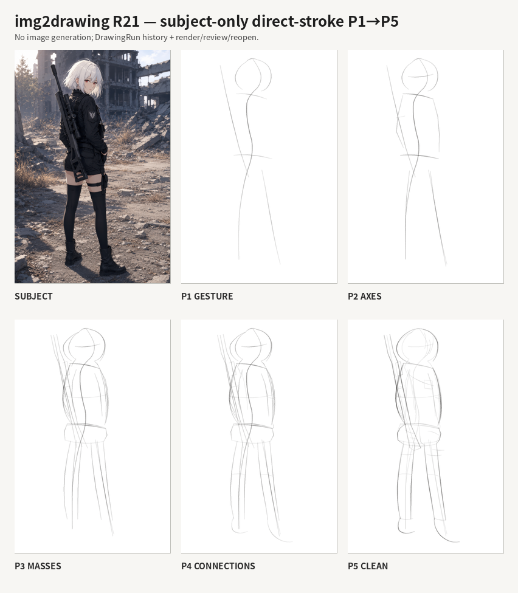

# img2drawing

An Agent Skill that makes Claude (or any Codex-style coding agent with skill support)
**actually draw** — with explicit, inspectable pencil strokes — instead of generating
an image.

Given one reference photo, the agent works through a five-stage construction pipeline
(gesture → primary axes → primary masses → structural connections → clean block-in),
rendering and re-inspecting its own drawing after every stage, revising until each
stage genuinely holds up, before moving on.



## Why this exists

Image generation models produce a finished image in one shot with no inspectable
intermediate reasoning. img2drawing does the opposite: it drives a real stroke-based
drawing session (`DrawingRun`) through explicit stages, where the agent is the one
deciding pose, anatomy and correctness — the runtime only renders, checkpoints, and
hands back evidence for the agent to judge. Every stroke, review, and revision is
recorded and replayable.

## Status

Pre-1.0 (`0.5.2`, release slice R22). The core pipeline, dual-reference review,
pass-memory continuity, reopen/recovery, and fresh-worker autonomy are dogfooded and
working. The bundled grammar-exemplar images for P1, P4 and P5 are still known-failing
against their own contracts (see the grammar exemplar audit in
[`skills/img2drawing/SKILL.md`](skills/img2drawing/SKILL.md)) — the runtime warns the
agent about this at review time, but a full contribution replacing those exemplars is
still open work. See [`dev/CHANGELOG.md`](dev/CHANGELOG.md) for release history.

## Requirements

- Python 3.10+
- `numpy`, `Pillow`, `svgwrite`, `jsonschema` (installed automatically)
- A coding agent that supports Agent Skills (Claude Code, Claude.ai, or similar)

## Install

**As an agent skill** — copy the skill folder into wherever your agent loads skills
from:

```bash
cp -r skills/img2drawing /path/to/your/skills/
```

Or package it into a distributable `.skill` file (a plain zip) with your agent's
skill-packaging tooling (e.g. Anthropic's `skill-creator`), and install that instead.

**As a Python library** (the skill's own runtime code, usable standalone):

```bash
pip install skills/img2drawing/
```

## Quickstart

```python
from img2drawing import DrawingRun

run = DrawingRun.create("subject.png", "out")
run.stage_start("P1_gesture")
```

The agent then observes the subject, authors explicit strokes, calls
`run.prepare_stage_review()`, inspects the rendered evidence, revises, and advances —
one stage at a time, without asking for approval between routine passes. See
[`skills/img2drawing/QUICKSTART.md`](skills/img2drawing/QUICKSTART.md) for the full
autonomous loop, and [`skills/img2drawing/SKILL.md`](skills/img2drawing/SKILL.md) for
the complete operating spec.

Run the bundled subject-only benchmark:

```bash
python skills/img2drawing/benchmarks/stage_reconstruction/full_body_croquis_subject_only/run_smoke.py
```

## How it's organized

```
.
├── skills/
│   └── img2drawing/   # the deployable skill: SKILL.md, runtime source, references,
│                       # playbooks, schemas, benchmarks — everything that ships
└── dev/                # release builds, dogfood runs, verification evidence,
                         # and the changelog — not part of the shipped skill
```

`skills/img2drawing/` is self-contained and independently packageable; everything
under `dev/` supports developing and releasing it but never ships inside the skill
itself.

## Contributing

Issues and pull requests are welcome. If you're extending the drawing pipeline itself,
start with [`skills/img2drawing/SKILL.md`](skills/img2drawing/SKILL.md) — it's both the
spec the agent reads and the source of truth for how the runtime is meant to be used.

## License

Copyright 2026 ictseoyoungmin. Licensed under the Apache License, Version 2.0 — see
[LICENSE](LICENSE).
