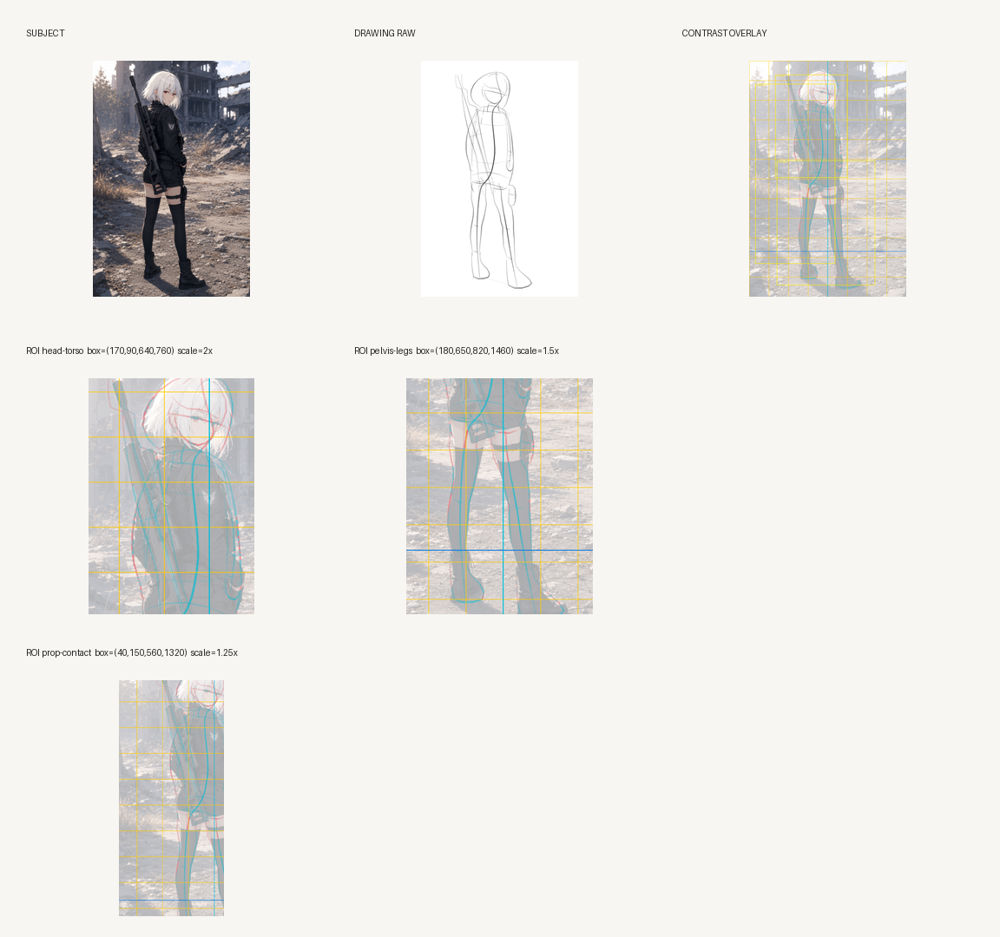

# B02+B03 direct visual review

Review date: 2026-08-30

Inputs are the public `croquis-sniper-girl` subject reference and its P4 current
drawing. The drawing is registered at the explicit half-scale mapping
`canvas = subject * 0.5`.

## Observations

- `inspection_sheet.png` shows SUBJECT, DRAWING RAW, and CONTRAST OVERLAY together,
  followed by the selected head/torso, pelvis/legs, and prop/contact ROIs.
- The non-identity registration places the drawing strokes in the expected subject
  coordinates; the overlay no longer samples the inverse side of the mapping.
- Red/cyan ink remains visible over the dark jacket, rifle, leggings, and boots.
- The whole view exposes the silhouette/axis mismatch while the three enlarged ROIs
  make the local drift and contact regions readable.
- Yellow grid lines, cyan plumb line, and blue ground guide are visible and remain
  guides rather than semantic judgments.
- `inspection.json` and `measurements.json` bind the view to subject SHA-256,
  drawing artifact SHA-256, and the stage-free drawing-state SHA-256. Artifact
  references are basenames/output-relative names only.

This is direct visual evidence for the inspection capability, not a drawing-quality
verdict and not vNext PASS evidence inherited from the legacy R23 review.
