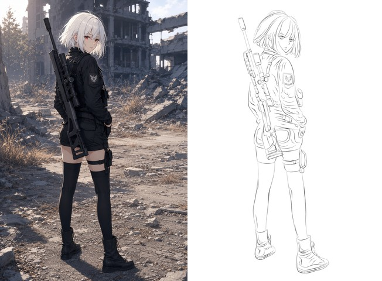

# Observed Croquis — GPT-6 Astra · v1.0.0 baseline

This entry records the high-capability demonstration used to promote the A8-aligned
img2drawing system to the first stable release baseline.

## End-to-end process

The original canonical run contains 124 sampled replay frames from action 0 through action 490
with `every_n=4`, including the final action. The repository GIF above is deliberately a compact
8-frame full-span preview for fast GitHub browsing; it includes the beginning and final drawing
state but does not replace the canonical replay evidence recorded below.

## Execution provenance

- Worker: **GPT-6 Astra**
- Reference mode: `observed`
- Drawing mode: `croquis`
- Finish intent used by the run: `subject`
- Style: `pencil_loose`
- Executed package identity: `0.6.0rc2`, A8-aligned instruction graph
- Stable release baseline: **1.0.0**
- Drawing/runtime behavior added between the demonstrated A8 baseline and 1.0.0: **none**
- Canvas: 1024 × 1536
- Renderer: `pillow-pencil-contact-v9`
- Broad fill / `fill_region` actions: **0**

The release promotion changes package/release identity and documentation. It does not retrofit
subject-specific drawing knowledge into the runtime.

## Session evidence

| Metric | Value |
|---|---:|
| Total actions | 490 |
| Stroke additions | 358 |
| Stroke replacements | 120 |
| Stroke deletions | 12 |
| Fill actions | 0 |
| Canonical timelapse frames | 124 |
| Canonical timelapse sampling | every 4 actions, action 0 → 490 |
| Repository preview | 8 full-span frames, action 0 → final |
| Canonical PNG vs replay final | exact pixel match |
| Decoded canonical GIF final max-channel error | 1 |

The drawing preserves the back-facing torso, face counter-turn over the shoulder, asymmetric
hair mass, open stance, unequal boot directions, diagonal rifle/body depth, and identity-bearing
face/clothing/prop details using authored strokes rather than generated pixels.

## Why this result matters

The run is evidence that the current instruction graph can be executed as intended by a capable
worker:

- a small provisional relational construction does not become permanent geometry authority;
- the reference is re-read when visible contours and identity-bearing geometry are authored;
- occlusion is reasoned through without exposing unsupported hidden contour;
- obsolete construction or proxy marks are deleted rather than buried under more strokes;
- local corrections use replacement/deletion instead of uncontrolled line accumulation;
- the finished subject remains readable without broad value fill.

## Claim boundary

This is a **curated capability demonstration**, not a substitute for the formal D01-D06 sealed
validation campaign. One successful worker/subject does not prove cross-agent or cross-subject
generality.

The original subject-specific authoring scripts, coordinate tables, and control-point notes are
intentionally **not** part of this showcase or the deployable skill. They are evidence from this
run, not answer templates for future workers.
