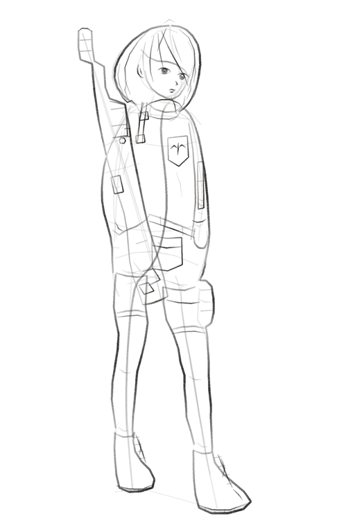

# Sniper Girl — Full-body Croquis

## Production details

- **Model:** Claude Opus 5
- **Skill:** img2drawing `0.5.2`, release slice `R22`
- **Prompting:** single initial prompt
- **Process:** An autonomous run started from a single user prompt. Internally, it went
  through the P1–P5 stages, reviews, reopens, and an identity finishing pass.
- **Output:** This is not a single finished image from an image-generation model. It is the
  result of a drawing run that recorded explicit strokes.

## Original prompt

> zip파일에 저장된 스킬을 충분히 익히고 사진의 크로키를 완성한다. 최종 완성본은 형체와 동작을 식별하는 것에서 끝나는 것이 아니라 얼굴(눈,코,입)이나 머리카락(단발), 착장 디테일을 표현하여 특정 될 수 있게 한다.

## Continuing the work

This result does not end with the final image. The same or another agent can continue
editing it using the JSON action log and checkpoint saved during the run.

The full execution record is preserved in
[`dev/dogfood/croquis-sniper-girl/`](../../../dev/dogfood/croquis-sniper-girl/). A future
worker should first read [`CONTEXT_CAPSULE.md`](../../../dev/dogfood/croquis-sniper-girl/CONTEXT_CAPSULE.md)
and [`02_run_record/DOGFOOD_REPORT.md`](../../../dev/dogfood/croquis-sniper-girl/02_run_record/DOGFOOD_REPORT.md)
to understand the current state.

`02_run_record/checkpoint.json` contains more than 43,000 lines. Do not put the entire file
into a prompt or load it wholesale. Extract and pass only the ranges relevant to the
requested stage, action ID, or reopen ID. The run archive's
[`README.md`](../../../dev/dogfood/croquis-sniper-girl/README.md) documents the query policy.

See [`metadata.json`](metadata.json) for file-level metadata.
